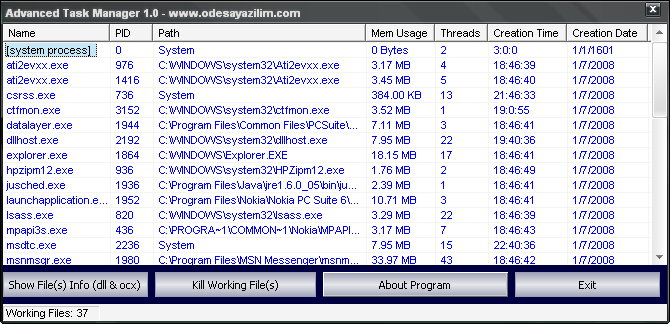



## Advanced Task Manager

### Description

This code is a strong task manager.It's have a special part.This special part show which program (in task manager) use which dll(s) or ocx!
 
### More Info
 
ublic Type PROCESS_MEMORY_COUNTERS

cb As Long

PageFaultCount As Long

PeakWorkingSetSize As Long

WorkingSetSize As Long

QuotaPeakPagedPoolUsage As Long

QuotaPagedPoolUsage As Long

QuotaPeakNonPagedPoolUsage As Long

QuotaNonPagedPoolUsage As Long

PagefileUsage As Long

PeakPagefileUsage As Long

End Type

Nothing Only Basic Controls

             |
---                |---
**Submitted On**   |2008-07-01 12:57:20
**By**             |[Alper ESKIKILI�](https://github.com/Planet-Source-Code/PSCIndex/blob/master/ByAuthor/alper-eskikili.md)
**Level**          |Advanced
**User Rating**    |5.0 (15 globes from 3 users)
**Compatibility**  |VB 5\.0, VB 6\.0
**Category**       |[Complete Applications](https://github.com/Planet-Source-Code/PSCIndex/blob/master/ByCategory/complete-applications__1-27.md)
**World**          |[Visual Basic](https://github.com/Planet-Source-Code/PSCIndex/blob/master/ByWorld/visual-basic.md)
**Archive File**   |[Advanced\_T211908712008\.zip](https://github.com/Planet-Source-Code/alper-eskikili-advanced-task-manager__1-70771/archive/master.zip)

### API Declarations

No api

